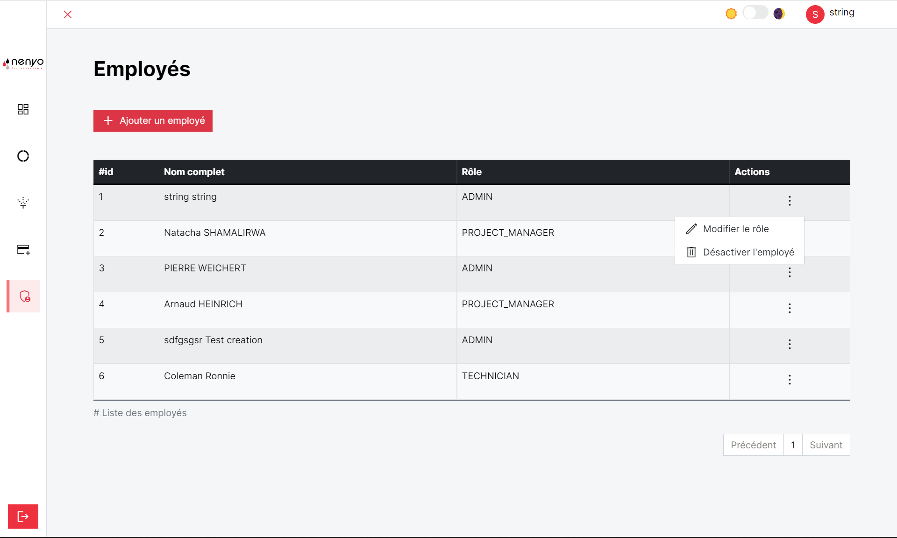
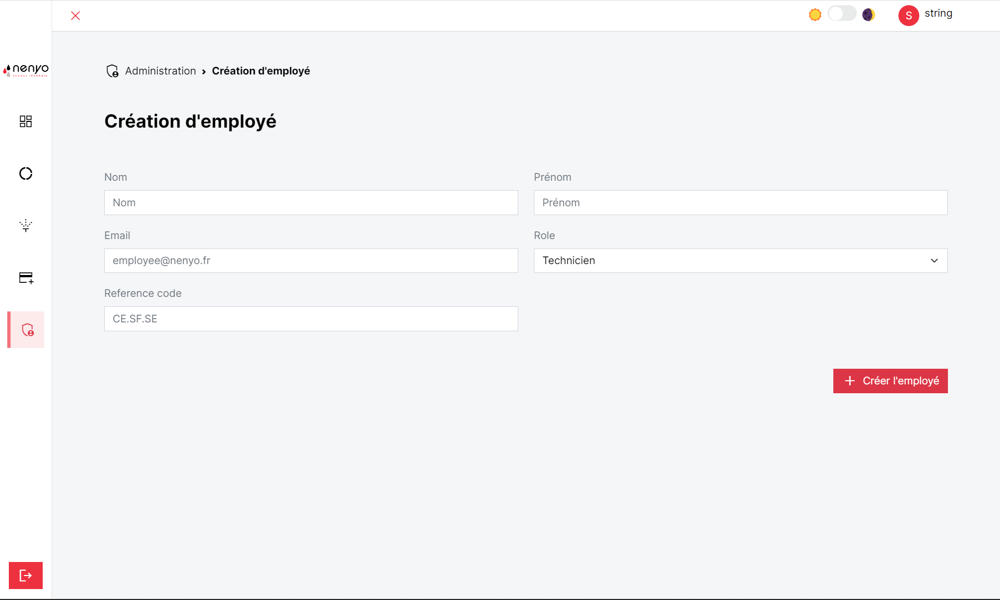

La section administration permet la gestion des employés par l'administrateur. Il peut soit

- [x] Créer un employé
- [x] Modifier le rôle d'un employé
- [x] Avoir des informations complémentaires sur un employé
- [x] Désactiver l'employé

## Création d'un employé

Pour créer un employé, l'utilisateur doit remplir le formulaire ci-dessous.

!!! warning "Création employé"

    Il est impossible de créer deux employés partageant la même adresse email. L'email est unique d'un employé à l'autre.

