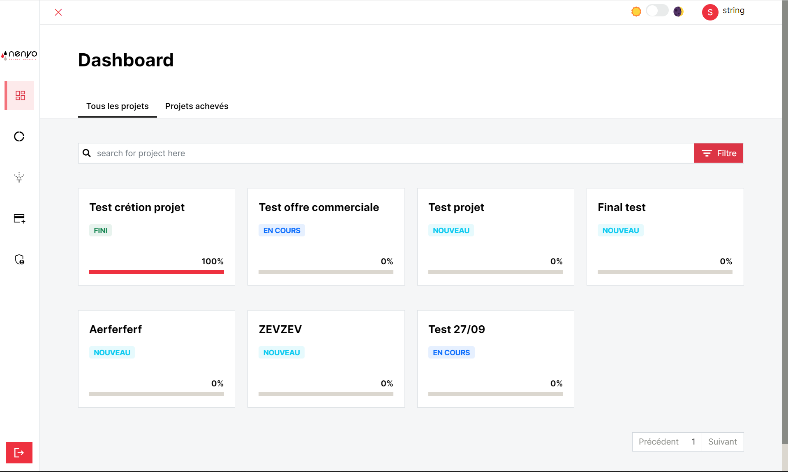
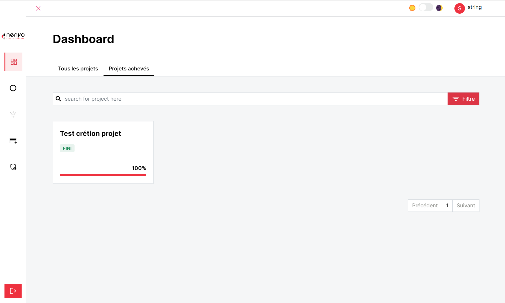
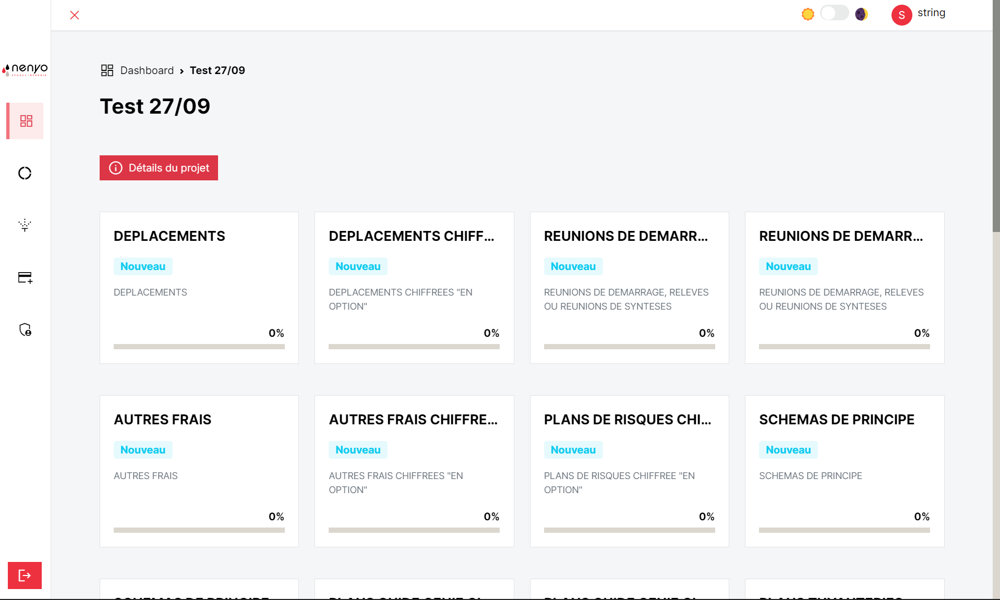
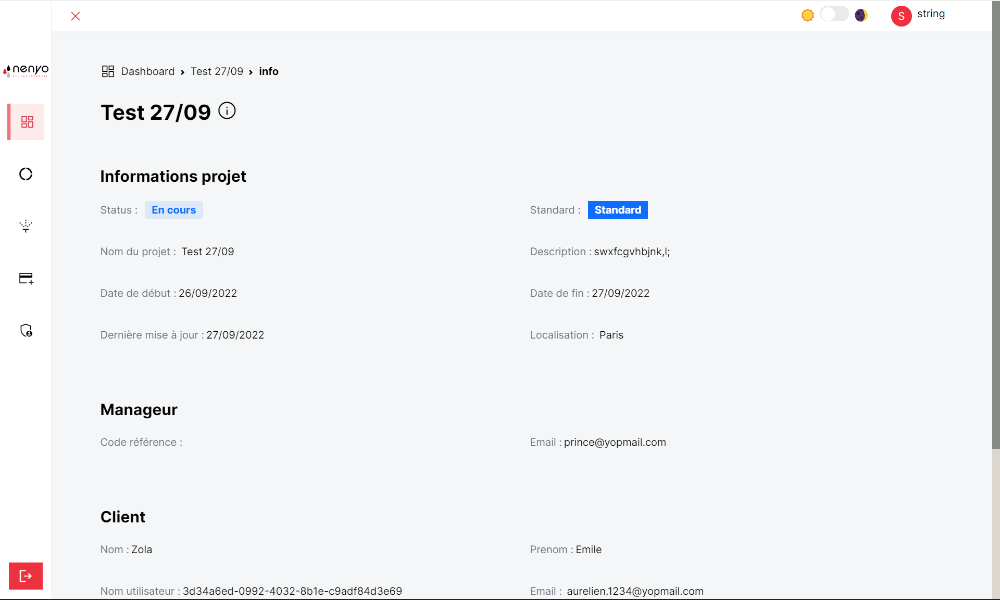
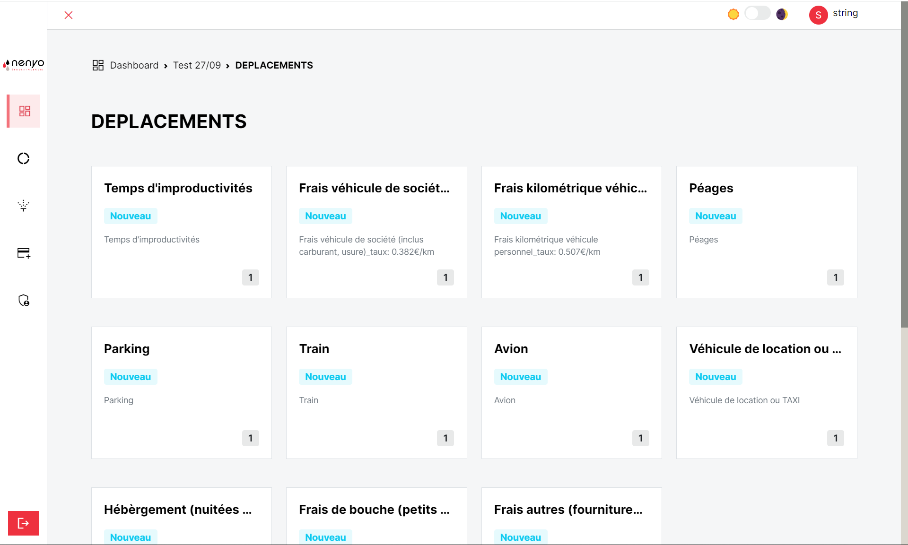
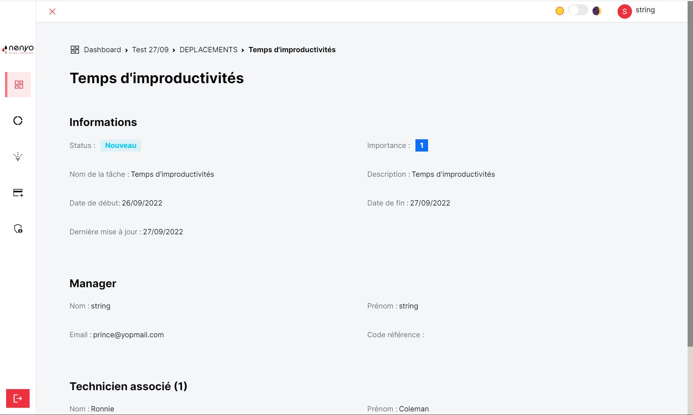

# Dashboard

Le Dashboard permet d'afficher et d'avoir des informations (statut, pourcentage d'avancement etc...) sur les projets
dont <b>l'offre commerciale a été validée</b>.

Il permet aussi d'avoir la liste des projets finis.

Toute les pages de l'application possède une barre de recherche permettant de filtrer les projets affichés selon le
besoin de l'utlisateur. Il est possible d'ajouter des filtres à des projets afin d'avoir une recherche plus affinée

## Phase 

En cliquant sur un projet, l'utilisateur est dirigé vers une page contenant l'ensemble des phases du projet et un bouton permettant d'avoir des informations complémentaires sur un projet. 

<b>Information complémentaire sur le projet</b>

Le `click` par le client sur une phase conduira l'utlisateur vers le detail de celle ci. Il pourra retrouvé :

* L'ensemble des tâches de la phase
* Des informations subsidiaires sur la phase

## Tâche

Enfin, lors du `click` sur une tâche, l'utilisateur pourra avoir les informations sur celle ci.

