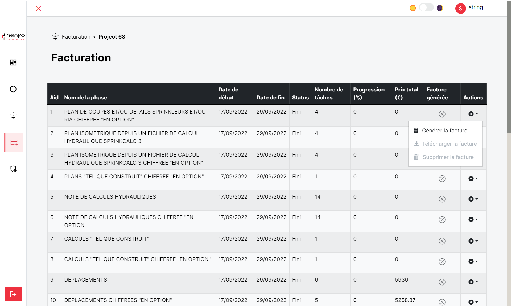
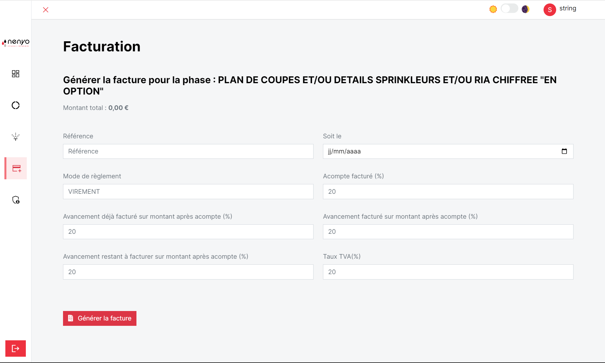
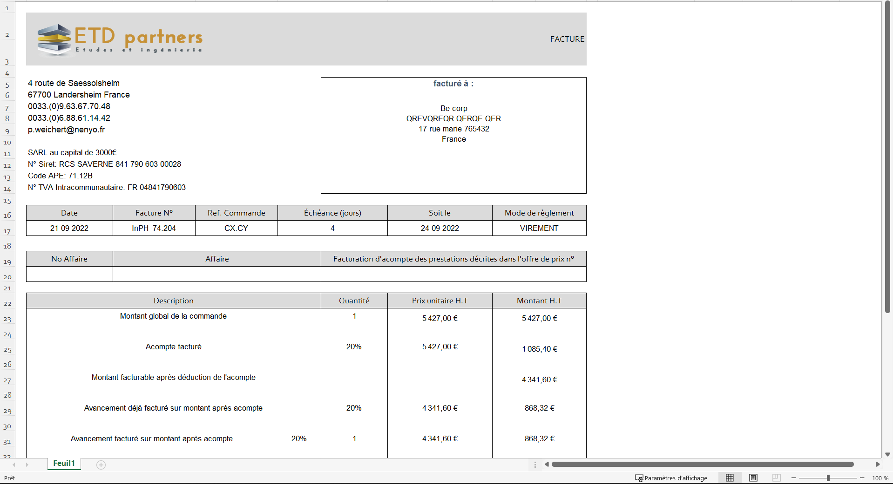

La vue principale de cette section est la même que pour WeNYou etc...

L'utilisateur à la possibilité de générer une facture pour une phase.

!!! warning "Génération de facture"

    La génération de la facture n'est possible que pour les tâches achevées.

Il a la possibilité de : 
    - Générer une facture
    - Télécharger la facture
    - Supprimer la facture

## Génération de facture

Lors de la génération de la facture, l'utilisateur doit remplir un formulaire qui va permettre au calcul des totaux de la facture.

Après la soumission du formulaire, la facture est générée et est téléchargée.

