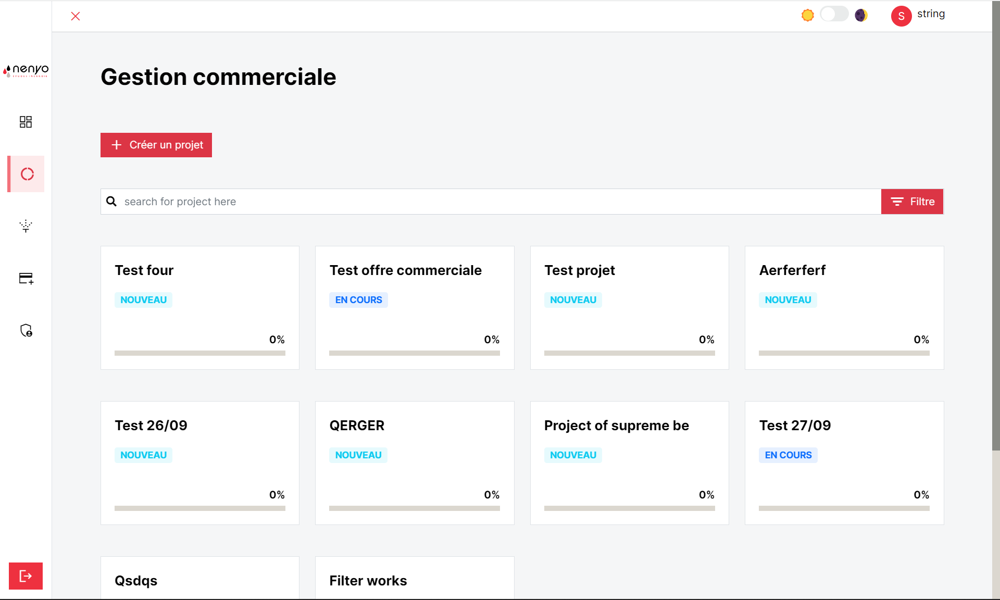
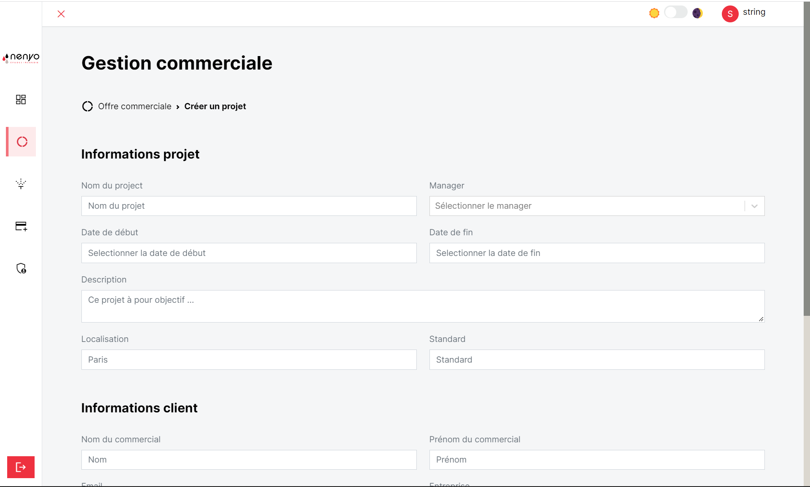
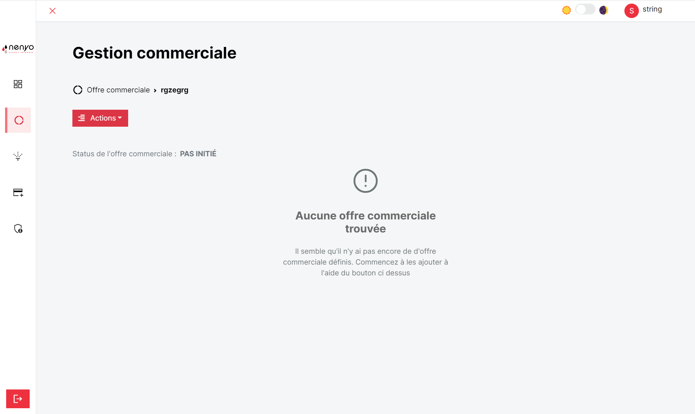
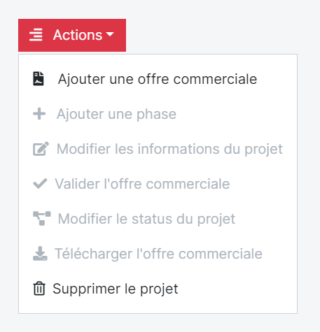
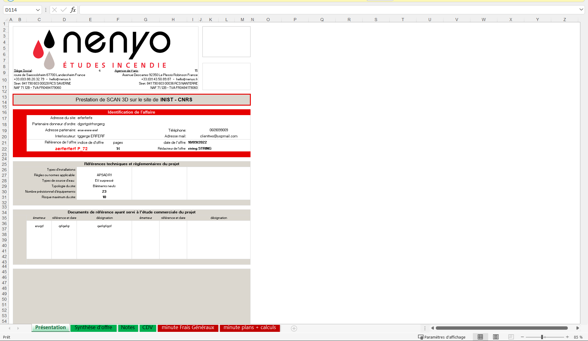
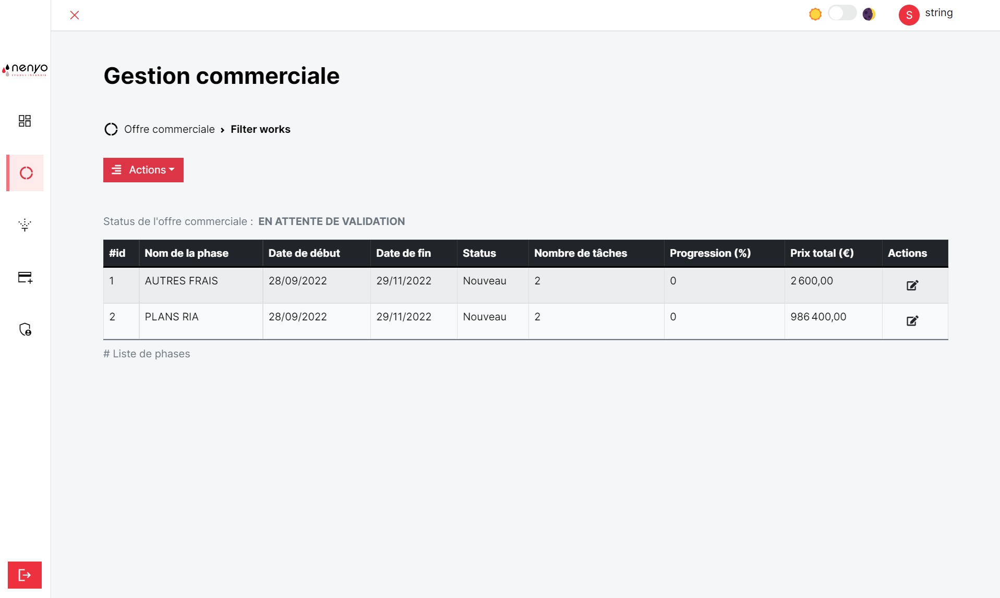

La gestion commerciale n'est accessible que l'administrateur et le manager de projet. Elle permet la gestion d'un projet (Création d'un projet, modification des phases et tâches, modification de l'avancement d'une tâche).

## Création d'un projet

Pour créer un projet, il faut renseigner : 

- [x] <b>Les informations sur le projet</b>
- [x] <b>Les informations sur le client</b>

## Offre commerciale

Après avoir créé le projet, le projet sera visible dans la liste de projet présente dans la gestion commerciale. Pour créer l'offre commerciale associée au projet, il faut effectuer un ``click`` dans le projet, et vous aurez le statut de l'offre commerciale à `Pas initié` et un message : `Aucune offre commerciale trouvée`.

Pour créer l'offre commerciale, il faut cliquer sur le bouton ``action`` et puis sur `Ajouter une offre commerciale`.

Vous aurez une page qui s'ouvrira avec un formulaire en <b>5 étapes</b> vous permettant de créer l'offre commerciale.

Après la soumission du formulaire, le fichier <b>excel est généré</b>.

 
Après la création de l'offre commerciale, on peut observer l'apparition des phases dans le projet, ainsi que le passage du status de l'offre commerciale à `EN ATTENTE DE VALIDATION` afin de l'afficher dans le tableau de bord et de permettre l'envoie d'un mail au client pour lui signifier de la validation du projet. 

## Opération sur l'offre commerciale

!!! note "Génération de l'offre commerciale"

    Il est important de noter que seules les minutes qui ont été remplies seront affichées à dans la liste des phase du projet. Les utilisateurs ont la possibilité de modifier une phase ainsi que les tâchees associées. En outre, ils peuvent aussi en créer de nouvelles.

L'utilisateur a la possibilité grace au bouton action de :

- [x] <b>Créer une phase</b>
- [x] <b>Modifier les informations d'un projet</b>
- [x] <b>Modifier le status d'un projet</b>
- [x] <b>Télécharger l'offre commerciale</b>
- [x] <b>Supprimer un projet</b>

!!! info "Validation d'un projet"

    Pour valider un projet, l'utilisateur devra entrer la référence de l'offre commerciale.

!!! danger "Validation d'un projet"

    La suppression d'un projet est définitive.

    