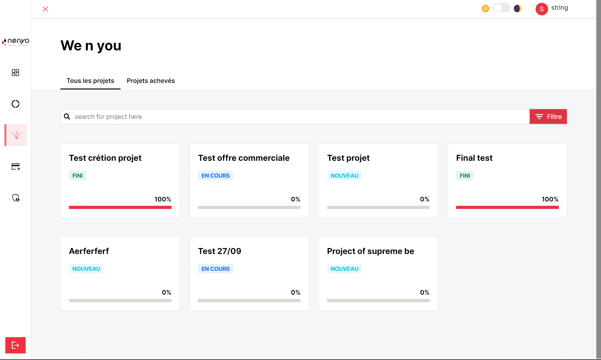
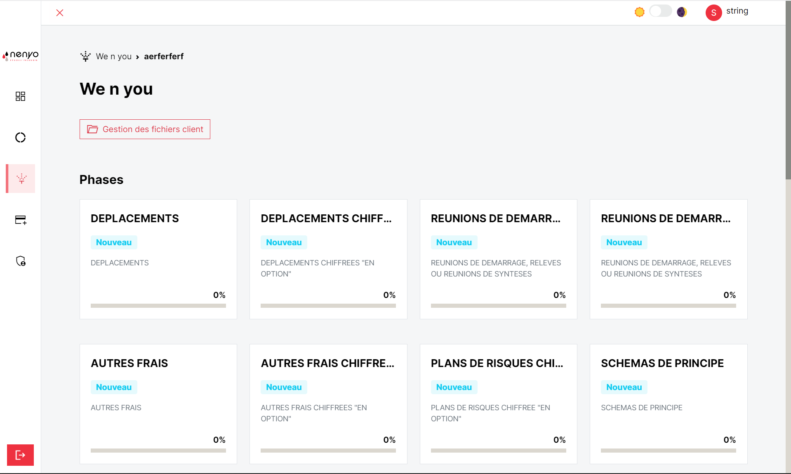
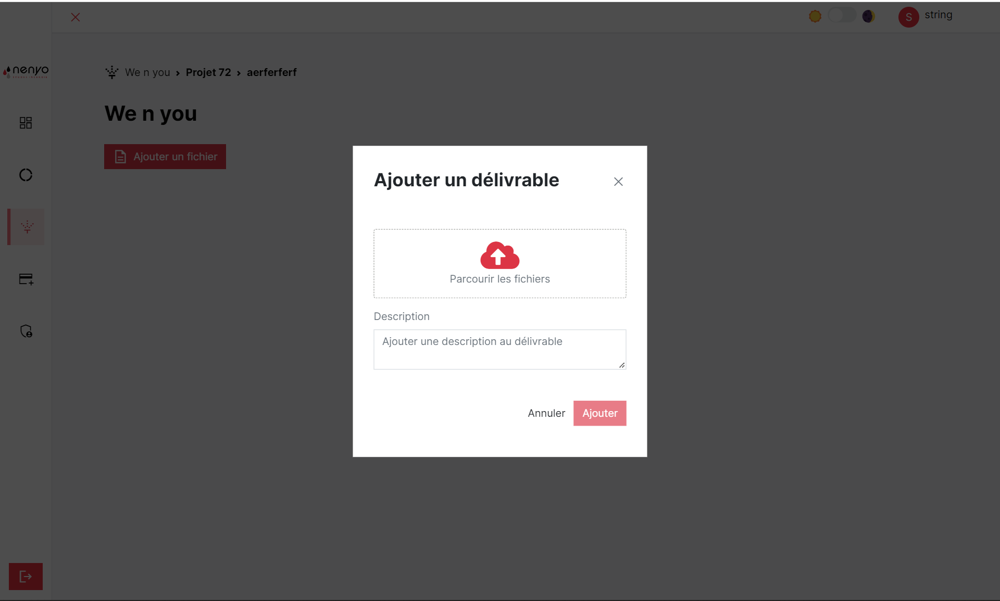
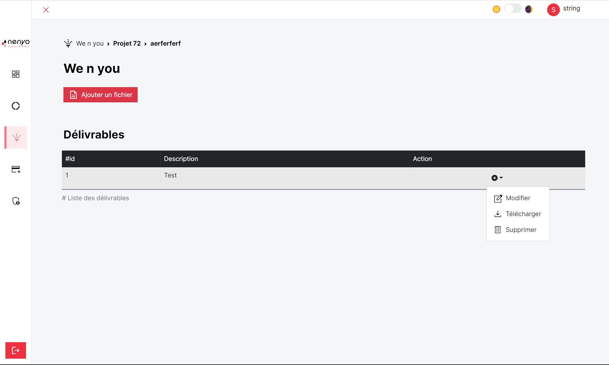
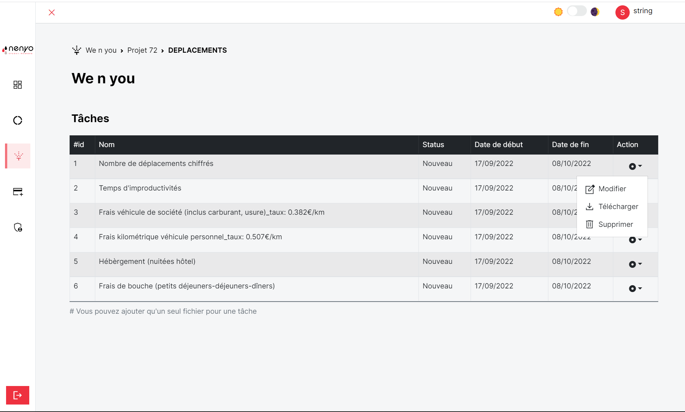

We N You ou boite aux lettres est la partie de l'application destinée à l'ajout, modification et suppression des
délivrables clients. Elle permet aussi aux techniciens d'ajouter des fichiers pour le suivie de l'évolution d'une tâche
par un manager de projet.

La vue principale de we n you est la même que pour le tableau de bord, la gestion commerciale et la facturation. Nous
avons la liste de
tous les projets validés dans la gestion commerciale.

Le `click` dans un projet renvoie dans une autre page permettant contenant un bouton pour gérer les fichiers clients.
Ainsi qu'une liste de phases permettant de gérer les fichiers associés à une phase.

## Gestion des fichiers client

Le `click` sur ``gestion des délivrables client`` permet d'afficher une page avec la liste des délivrables disponible
dans la vue du client. Cette page possède aussi un bouton `Ajouter un fichier` pour ajouter un fichier au client.
Celui-ci est notifié ci est notifié par mail lors d'un ajout.

Après l'ajout d'un délivrable, il est possible d'effectuer les opérations de modification et suppression sur celui-ci.

## Gestion des fichiers d'une phase

!!! warning "Délivrable client"

    Le client a la possibilité de télécharger un dévrable de WeNYou, il peut effectuer des modifications sur celui ci et l'envoyer à l'intention du manager du projet depuis l'application.

La gestion des fichiers dans une phase est la même que pour les délivrables.

