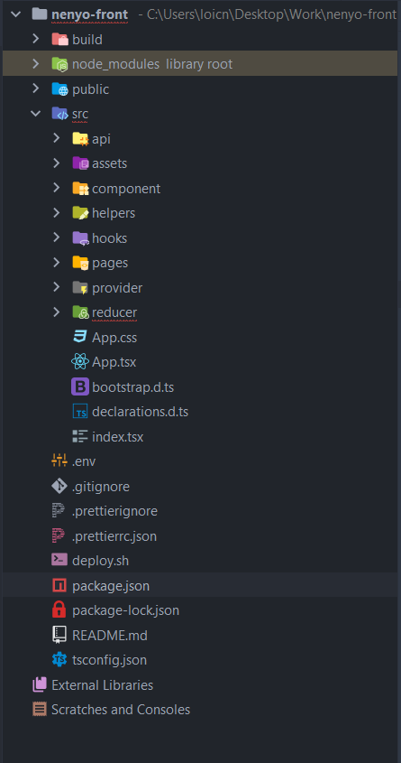

# Folder

- [x] <b>api </b> : Dossier contenant la configuration de rtk query et des requêtes http
- [x] <b>assests </b> : Dossier contenant les fichiers statiques de l'application : 
    - css
    - image
- [x] <b>component </b> : Dossier contenant les composants l'application.
- [x] <b>helpers </b> : Dossier contenant la configuration globale de l'application et certains services de l'application.
- [x] <b>hooks </b> : Dossier contenant les hooks de l'application.
- [x] <b>pages </b> : Dossier les pages de l'application.
- [x] <b>provider </b> : Dossier contenant la configuration du rtk query.
- [x] <b>reducer </b> : Dossier contenant la configuration des reducers redux.
- [x] <b>App.tsx </b> : Fichier contenant la configuration des routes de l'application
- [x] <b>App.css </b> : Fichier contenant les styles qui impactent toutes l'application

